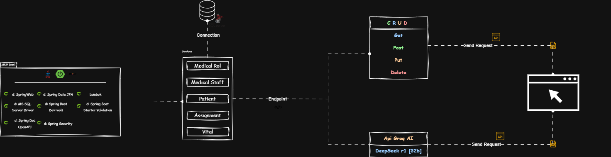

<!-- https://postimg.cc/delete/ZQpVLBR2/2cfc1eb3 -->
# 🩺 Vital Signs Management and Patient Status Analysis System

The project **Vital Signs** is a technology solution designed to facilitate the management and analysis of patient vital signs, It features an API __(Application  Programming Interface)__ developed  in Java that allows the insertion, saving and processing of medical data. This system integrates with an Artificial Intelligence API to generate detailed notes on patient health status.

# 🎯 Objectives
1. Data Capture Automation
2. Integration with AI 
3. Healthcare Improvement
4. Scalability and Flexibility

# 💻 Technologies

# ☕ Dependencies

# 🌐 Logic and Usability

## 📋 Diagram 

<a href="https://viewer.diagrams.net/index.html?tags=%7B%7D&lightbox=1&highlight=0000ff&edit=VitalSign&layers=1&nav=1&title=VitalSigns.drawio.html&dark=auto#R%3Cmxfile%3E%3Cdiagram%20name%3D%22Page-1%22%20id%3D%22AxoExCXQksUwV4fwTD9_%22%3E7X1Zk6O40vavmYj3XEwHu%2BESMNhsZrOxzc0X7GAw%2B2L49Z9U2%2FRSNV3Tp6uXM1URZYMQslBmPrkoJf7A%2Bett03p1qlVhVPyBIeHtD3z9B4ahKE2DL1gyP5SsGPS%2BJGmz8KHsrwI7W6KHQuShdMjCqPukYl9VRZ%2FVnxYGVVlGQf9Jmde21fRptbgqPv3V2kuiLwrswCu%2BLD1mYZ%2Fel9Ik8lf5NsqS9PGXUeThytV7rPxQ0KVeWE0fFeHCHzjfVlV%2Ff3S98VEBR%2B9xXO7vE1%2B4%2BtSxNir719wQO6PQZ%2FSfnhUy%2F8%2FnnD%2FTP%2FE%2FUYS8b2f0iuHhkR%2B628%2BPY5C01VA%2FVIvaPro9N%2FKe%2F1gd%2BbJn6NPzAk6JqmvUtzOo8tAQ%2FXDHI488tjD9NeAY81CWfjzYjzd6D0ROnpr%2BaxzAwcNQ%2FKNhob4%2BLICgNTyEPBW1f%2BBcXJW9%2FXAdBedd7QVZmeyrGhYgoASM0iMXEQ%2FnT9yDEvcFRtVlfVaVoKiIYnCFS%2Ftr8dDklGZ9ZIN24W9MQOZAmVdkCawdgOG%2B60fh%2BVHxUTNPFyD1MsDb6mcVrlkYwl4%2FVWAfmny6AB%2BNr4oKtLIOo9gbCtixLo%2F6IH3oWjC0YyRmfQ8e%2BaHokiXJ3WgA4nMvMtDHjPJ3TPol%2F%2FxMBlk9wyDU3ajAsYJQc08kUNoMUMY5vrpmAbhge2UHvjT7r0vgKIHflzDHCHDtD5KbvPYPcv3YJujkfbP39b7gRTCm%2FXOs8CJBgUiXYQQfEXnk3HvspV7gso%2BY8A0o%2BSD62BeCTzxH1rejKv16sc%2Bud6rjRaHyq76vro%2FiyHlBntwN%2Bpdi9DmR%2BupOrLv6XqHF2Q0Sirv7QfaxFHksAcdp30N1yMKnx8QgLD9cOqCJs7H9UEaAacQkBR9hNGYArLu%2FDv8gkMLrow5Webx08Ubv4evPqs2SrPSKP6eqDa9em3%2FoxuRtGOCxnUd99MgQz6iCZzgCezuOYP71HHH1xqh8%2FP4ZPEH9YjzxiD9vazN9o%2Fx8MlSrL4eKfg5QyTcbKvRfLz5d3UKL6PHgSYD%2Be7lBked54VFOPpBfUJ%2F5gH%2Fyh33JDC9UeQPewL5mQv3FJI%2BGErzwZ3dnqQDiIHR9u7eenuyobzK7wvvW7DsCHSP%2FH1pdH5lGrzfAnrOxPjXKvt2MfwOe%2BgxfPmKp1Y8FFPzrgBKVIQtdf3BWVmX0KYU%2BHeMHF%2B0TwzYKvwgJfAcHhXxmmB7L2gigRjZ%2B%2BqvPjd3DLxhVdicfD0TBP9WP5GeKr6uGNoge7vk4QPBZMxj59%2B30XptE%2FRft3NHx6Zn%2FG9IS%2FwO6IlwwoC7QD%2BECOO9DAPoAgL%2BvWlgXE%2FvoCowCEcUInEBR%2Bs8HleBXVf9nUSXVh7p8Y1sKxz%2FQ1FfNKewDxvxQi%2BqHRKG%2BacSYr1pUz0Ye3g4A%2F0Fk6peVkl%2FWovpKeOJXt6i%2BGpT6KRYVOFh7vQe%2BZIP9N9tWr%2FPdfp6z9oro18%2Fya%2BlPbZOf79i%2Bx4XeEIbp3xqGsefiQz8FhtXq6lf5vxlyX%2BCkX8WdxV4RH%2Fs1DN%2Bnie2fBrmPQ%2FMOuW8AuS9N0f8ukPtcWOiXsHw5mOABDOBo3FdV0f2LsfgrWSA%2FH4tfEX%2F6Rczf58D4x4YhsFdEbN7B%2BFslhfi9wfi5ENWvBMZ277UQ7zDEAagaend8%2BC8G5hfY7VeJS2DPhbV%2BEWD%2BzEgmfjouv2cwvSEur35vXH4uZvVf5yw%2BNtHVXvlt0P5CyLiCP6zXUcka0kfofP87n%2F72vxG0X%2BDFXwW08V83SerzyMZPB238PUvq7UAb%2F72zpB5b%2Fj1A246Coc36%2BR2vX8uGvwhe46%2FIq%2FpFbOyfHYjG%2FxfylH5RtL5nw98VrPHngmI%2FM%2FABLyG2qd4hczvehTzWbXZ38G9F4pdY7FcJQxPkF0SAGamPCwurtk%2BrpALCJvxV%2Btmw%2FlVHre4XH4LCS9T388MiL2%2Foq0%2BpGt2y%2FvRwOzw%2Bf3S8hkMDTeKHUyiMzOrhzIjaDDw5pNr9DSUYhdPHJ3dNfSCBcDwU3LX3dPmuuaezL5t7yuWtgFjdl4hZ8djvuKgmtgQY98Agr0zjfSi6T439W930EMu8T379WwXPPM9Xr07u%2FS%2FZ5ock7%2Fz9FA6Jfa6qmS%2BECX1%2Brc6bpZbir0jU%2BVR6vrL68UcteiVeSF34iWNJPOfT%2F9e%2BiBaFEOrBVasqXquXfiuSvWTIfikcyLMEfTN6Phd3%2BI70tHsvjv9FFCV%2FPkXfJFpgAAUW3ZHu30JJ5udT8qsZLd9CSbbrgJF%2B%2FXcR8ykW%2FROp%2BVzM4L%2BmppP13r9KYz6T9v2jCfkmc2jQOc%2BC6J9mh%2F1C2318xTH4Orz%2B2I0%2ByFesovoHy0gfvedHT%2FrB5f3Yf%2F7Ee0Z%2BgOf6kj%2F6Y9akMsinFH8i%2BT9dlUqvPmvoc6Z462Wp1Jvs9COUYX3f5ddJPOSJu2DYtwbj2qjLlgffHrLf3a%2FfDSHJwY2G%2FkbOvz2yfy9mL8LCn8gHhGJWn9D3T%2By78B%2F2bKOP91dx3EVvwy7kK5KV%2FgGy%2FDco8bNk%2F6si%2B62yj34e2nhr2SdfETz6MkL5spr4bqHLX4W0X1DktaRlfjZpqVfkp%2FzL5BRHmQ8U9X3o%2BVxbb07Sl8NZ%2FucZCC%2FOxwX3M69w9qyAI%2F5n6LX5%2F7WJ%2F3%2FgAUHHkMev%2F9x%2Fwysoid%2Bf3G2hAQ9AyX%2F%2B88dzGRNf7cCXt%2FAvGgnIi1fe9CkR4ulxX3hK6%2Btd%2Fq59exr4p769TIHDz%2Brb0wC%2B3Lf1ywT1rtAvK%2F2u%2FojAoNpHrP0ZfHVTdi28O9z6eGtSCFdBmhWh6s3VACGl670gfzzj0qrNFlDfewoGwHT5B38RRz6pYcM7H9q8szAj4xHd0M%2BKNO%2F2SUXV6x5TFMCoFl7dZf7T1qlXABVZyT1kR3z3iAUcDtG7ZgVEqy%2Bt9e%2Fi836p4f74InbxrNP7%2Bb4738%2Frpb4aHf7xSPEFQm%2Bi%2Fnnu%2Fkehka5vqzx6TKN50N4xML4%2BK3q9A%2FWwVZR6tyfvmvirxHqgHSyqwO3QFACnKbgxKr%2FwtDg4XjA2ADd35cE5%2Btf5nRtWV23PVyV4AC%2B747QICMoE82%2BgzdF7%2FUdO3Fdk4vuw%2Bd8p2xczdZ4LuT7H7fjbMfs3LAn9Ucr%2FiauNqnvn9t%2Bf26mfz%2B1fnWD48YbWl9w%2BvDP778%2Fsz82N%2FmBm%2F4Y8y7e23L9g9nVURH30zu%2B%2FPb8%2F9z6KH83w33e66jcNVn1APvpDP3Gu%2FpsQ8980i38%2BkfzmIazfc%2FluCLf3w9n7U0yEu5hifOZwujUhyiapWPC3sw%2BpcEjA0cYEH1zOs2f4PRG1c4AV2NPOthCJbTsioEAVLnBkSxAPEbvtryheuYh2vq1A87kbg8aaG1pHeyZ2d8fo0Ft5H%2BXDlhNXpoOpTNqPkXX1KP2QsUMu6%2FRhPjuB4gSZ2SfObB4UwnQBuIswGxyuhxiNEXxu%2FDI6%2Brp%2B2v2BceAytwwh%2BGxP4CPG9cUwNA0Wu7AWQCDuvFWkK8tL2Rv9X9htjidbljPYMuEmFmGZa82dbzTbTzIhBvyFFchG8oaMN%2BUTayTqpIJu7RbwMJgcAIgtbvWMGsIqWev91LajAC5zGvjgJd5u4JIPdrkcRBRXjD2d2uC8OPFXszye7QuNCOxx4rttJ%2FL8nKVlISbLbbdJ8dnM9wg%2Fcbjq%2BzR9wN0UM5ntJc6jSRXUBg4sXC6SUqq%2F4ba0oOMBut4UiQaXn2xUyQAdwKUtYCffRFH6UB0rykfzw5bTFTrtTTTiIracCOrEz81qqbniOJMLKdMLqaV5sTWpZEdrFS7vS9MfefhMNqsG62FzxLSluZ3nYdgdpwThOzVUyWHeGkC4z218vEi5Wbrq2gzXG357tjiO3PhSY%2FKYBbqmwvFQ2BFfMYWNUiojWS5oPNFhv%2FcKNexWjBfAlS%2BFLDJozV3A4dFaW0mvlhchkEIiKpMxDRHygvHXgvLXbjU22yoaLDY7%2BGun4A27uyyL620rdXZV23QVxD8f99dYT5l1sm8IYSIrny3C7THFx5QKq43OTAu5THV%2B9Mwxo%2BVmtVGjIRcS2TP4pGeFqN31U7Ho%2BuSbyzREyKXkr%2FgBGxkadQjI2hJ4jKDnit4Ihn7TALYWaZQVrGqzzBt7KbYDKKkGL2TjukuXW0E5kkgroqLaDHeKFQQV0rTkB76n5oPoXBGU4dYVYpXkaIq0H2RwTFxx54bxtOWvDNli3jgqNHk68VR1M9j12iTn48ZuiTlRVz1vr8oToAbSeD4%2FWHvrWM32UMTDPhSgkBtuMmvkqrZGVp7pQ2swN3NwyPXZQTeNaLdpq3f2sKv7%2FUwMZ9HE6y3ATi5ceV7E0axLR6sOCihk9TIcz%2Flgi3apchbPHMwy9uQJlz36OtQ35aJLt%2BZWlUem3YDaFfi%2FnStXtgOE5mhlXF%2FO%2BnRYtd4hqHXlJOxKu9V5CXGU7nreuVF4BFqCG65ZD8GCh9hxtnZXroH9iVbXyYdHZ9BpsrPXXVBmxkEqysPcGvRMhSddO%2BjYXjsIuTKU0RhV4XS8OKUV35i1HKBhcxEogrviAMqyG6DmftlUPVE6mjrFl7maBnp1XaxVnDLdwQtDE1td1DoVU4cWJsDNBDribMMbPSMfzOx4jP0JjK%2BsgD454LcIbXfrDC6FXSfYiyofryJfy1gQrpKFPqdVvRjtdhd1ipufagVoII5aa%2FNZLw%2FTzeHUc7rpd1a%2BKSMKd6BYW3vWJ1EwZuphwhxuAyxheZNgq%2BVIV0w4Dcx%2B7R5MJ0MGGYhKRbuSZwx81mzskkDdHTAChYpZa8Dk4Y4kdml8AxCGgrjvd%2FXs%2BIvBeCeSL2OlcuFDqGLDMVNbWpWDz5LoH2EPr61AkobSnvn6oMVelWtXvSxJjSSFtRqUq%2BXq4loJGY0Lb6vbETzdFJDVNtG9AIy3nl22ieNTejlEdsfEeFnbQcHrR3Qc6iuxngRtt98Hzl7u50Y3L2fSM4KCHVh1RyuCNuxC5WDOJwSoRNyevYvcNm59FeikLDTuPFy3WZsmsUp02yN9B7ksIhJiSSnjcb8i4zjucCTc9kVkFbvEMTOnU5hRO4AnY3KT81buUV2P1e16qjMxhsUOrqa%2BkA7EIZ7Hs54BvOLENqswDd%2BUe8RwDnOg6mWDU2vEFmmO1FZOIB%2FHI4SGEK9RvUC1bGV0UaJVp3k41etAiyLa0HmHYphk5mbgv3AGIgMkr9L83O2lEzUY%2Bxvf9LY1cRV7MWRQYy2t0xw%2F9IwzCYSAsLHErSo9km%2By6zSrRMok9vv%2Ba%2FywHyA816Gr9N7mog7InTlhHxzdUkj%2BLEnQcPouQf3Vo93%2FaHf%2B9JfRrF7ebMl%2F1hH%2BhinJtw4UsTXQHsimrQBOIqz0on%2F8Puf1x%2B815%2FXqWBH1dvLxDXui%2F%2FA5r3UU1XYU5bAtMMLw%2FX845n%2F6%2Fr%2F38NEvGj5avZDk%2BMvMhNGv2KvxzZeGUp8iw5%2FPDAuFf1iRXw7M6s0GBn9FruYTxj4lzUatMEb3fHwHwo%2Fv9YUVQq9Ln8JsHyP114TwI5z5A8MJnCCIB%2F0JTuO7v%2F88F5P5xyvon6JCLwR9PkcBoB%2BLrARdf3y%2FMnL%2FzHchqOstge99%2FjCO4YfHt9z8V7JEf%2F1FSvjqwzNM8nZJE%2FjvGZL7rm%2BAzIK26qq475qie9hH4pnCt3g35EsM8Zjm%2FRdkvAy3z6Et8XZo%2B89i9T8uZ%2FhVmxi8sKvcj4nxkyvmA%2F0JNZ92EPincf0vm8I%2Fa%2BmtQ%2Fn0l8rlAUTvdpv9nCN%2By%2FUd9NfXd2DEZxT9LpyCfWpMoJ818IbrO%2BjXqIN3m%2BF1NsMU%2Bf%2FPBzjY3d32KjXxlU3kcfJTOxN9bk0%2B9owBQdNPmuQNdMI%2FW0fy1eWGX9UJd%2BGLhzrIbzC7i6KfrRCF6wdW6EcTs8S36QGU%2BLzhHz2l%2BxgC%2BYj2NiAgKLGiZrgztP43dMEL603fXBf8ST3X6A9QBcwrtm39ZS09%2BuvbC72lvH8hlm8l71%2BEFt9c3l8RbXnniheJ9wFdoQRGk3efn0o2jXwnnkA%2F9%2F7enCdeYTT%2Bq9aRoiSBfcA%2FJcq3LiW9b%2Bsj6MD%2Bvt03J%2Fbv%2BWrIN8nh4vvbUw7X6XStZCFwfRKHc%2FstssPrmtiS22qLuNzen41sFzYon%2FGeYBYUJyGIecmAa0RtYdKQsQYMx%2Bb5Aff4S0v11KmVI%2B9GRvEtW%2FiDt5Ms9qgSk4K3%2FdgMdT1TzNUryN3%2BdDJov433GkyKMndGGMJ8LnBywo%2FhCUf2VoCNpsdxlbBJnvs%2BC7k585RhK3HH7ZWdQTU2WjjeQR00GxeoRpSpKZsmN8Irhy%2BzC3bhxspZ3ZrdanFlvY3kfGWnR8XHmCsjx4XCd1neKYdioJlIrhOttCmD9LodbRTnaDnRO%2BZaWo1o%2Bbx9EEBPt5ZCSYV8mEritt6n9o0DNa%2B9awfX4RJRva52vbI1xVpIdfyYS4czzIwoiwFzbUvMxot3kjatFNkbz0zho6POebweMsuLO%2Bt84ot8lkTDGksf3JRX0twmXc2DtujuYrEtNdw8rSHNAYetOmJsFmp4We2Woa0RZs11ig7aPMhd7eUrxclXQxZujIPI6%2BvBO1kBcxbbqUlg3pRmiyj8felQz8F23vM84hROsu7Va6FZh2toD0OpRLbIy0oMKrrGcBlogj%2Blzq3OvLxt9tJuSzoZx2lrpWPD%2Foy4s5JbdN1jTotMYrngsUOEdpRbt%2F3K9VJ7HU5EM9F1aIcCH9d0kdul4gt5zU9r6Zgei8o7uLaYe4fUlXMpOFwJl4GjVGEG2ubxAK4aQr5T9H1x5FFXB%2Bd2jjb7Q2qxxbGIjN0aY%2BohldCK9CQN8uv1TMCkHx8cKsAub%2BfU7VdeN6SbC2fU5lYVz46sQEkjneUudUna4cJWqfIpohBFsoeyY8%2BgE5yM4oq%2B6sgVMi7j6qZAGvQ8L3Am76CxbF89mOgUOvx4zrMQsNqGmulrgtjo0ZLyE03l%2BdQsllaaCSco9XqPHoNVM%2FPihrOUMNvLIoGbGbvvNzqVtESix9iy30iemXm1Zjpp1xlWlqqIqJUXZ1prmUcHUgp60PEDkvUG77NpLbQHnpEHns9ZF8jk2t4upookC%2BGZbLm%2BEuHB1CD5DxBU5e7Feo6jmo2dxECCSphbh9l9QuYQLiAvDHhl9By1JcerbJSDxN5yfsbIZetk1w0q7LciNUYWYlLphKxS2XR6%2BybTfTMghFyFa73X84Hp0%2BR8yumoB%2FhN50dAJnGolwtTbWbOtWDuopzbyr6%2F7O85sHDROI3ycHbVasxEVyk3ra9oZX3sec49w%2Fydqy0SEgazvFx7TpB0a7bKYdWcxQh1UUK1B547nFPcbuZFT0L0oEtuoWP7HU%2FX%2B6YuDKzNWjZ3J6To5HUa4nkDe8Vq%2FrmhG2Te2%2FhZR4y50IF28meYishvzepgWIPdH0%2BFezjw%2BBmhjgD5Me4YoVlTO3XQbGAruEgXh6ygOckaCldcry3ZTi4Wb00KkECr5q1sM6i2aN8kCPvyuF%2BP1Ybbwfh%2FRphJcBsFAvW6PZOEVbbhjr5%2BpkqWRBDyANNM15c7MOVQ34uqQqGsjgDCBkHLXJGVjW3PJgRedUctqlqpK5mokH1zhRX83WF9Cc8B4yQ9BpDUwLZryMpYKmeznuFMdBEuVFQaWqLA2Qq0vwZ%2BWx3gzPcwHso0jV1dJ0L4mFRGMIWCyAxXpN12IS8oVO3WrZhhQuw6z2bC4WRhG5hpr4ct5C0gyZ4pBYLg7uuURC9Aya5VLpdO4Q5I3nZ%2Fcm5kAaV4o1dMcdkjrNsJBVcFm10zWaGopXg5oRe5E6Mo4q5QoWxG1d7CHMJ6YaDkbw%2BGhlezfbJZWbV3pmgmN5iRuFmr55UywQxjVmk4Ee9uhEMh7PVGUoLEkjt9hD0MfICQMYqsmP2Nd2FCoYikjhdcqsGKFw%2BSSM1OWZnZM5qe7jTFdGk87mChQF0Mp%2FVNFWJG5sNmW%2FnmsdWN1USpgrSl2HxLePWQU4pZWCVPnLkKD71ks4SM1bSbK%2BlqrEFe%2FGAwEn64Du1ltb%2FtISYm8UG0kY2HbWuM1xRhvAnFiCOFbG8Sss7GSl6yGV8P2F6OUhPccF4dpl2Fte2a3a%2FXnblT0xaLj7txEfhCioYtdskMwVu7s94NO5iHGBX%2BStUOLVltY02E9hS3UmL83Jv81j0SNaUyg769iUVywfF0wNYN6l%2FDrXfl6Twnb7B64xkkdSg5jaun2MeKYrMxubG%2BsoK5AsywvzLIzoI1A%2BB6EjZhMcUVqsx1dToCWbpnaRa%2FpOC%2FhOmdCkBPfZMdd5sQPFMvqSVe7CiJVnzbQcfDSQbwRfMdYVbTESifCgppCjWg2te3tXeBGc9zj81Jq9%2BW0MRFil%2Fq9kh2abwjqplQNhHj6UzHA9n0u9FRhZJ0a5ifWGpVgUzaSZmDg6vPuER5Bt6dbP92nna767JhxTHld93ZdZXREQnZa5ZkRSVrYmfqyNGTznjVb1xsRWOFqIImuSk8qi2LVLmI9IRTLwFJAVWMods2pdAYvWPLyMVmF4WZwy2Hh4uDpKaYdHOYKUImCYHljKfoeqWW1SlLWW3P4DzB5Np%2BXzDoKd4aVWDhdad6GiWw53af%2Btjq6AbeTujmi8n400YMWwDp3KkbgKEs7m56xY971tGRQOabMxZb04WqV%2FO1QT2h0t30ENBbiMZ2iO8ltvZY7NKdlzK%2BmFF9PtBeOE8JKmGjO25N45ysZmauuELQuy1Gr33aP2%2FXq0PGabK0relY6Gyq2mNb9Ni1g%2B536YnwfVrX8a0gRPbO60%2FizZqP5xvfNDrMaj0jPZAn%2BWRfVwidjj5vItippTkzWx26UK%2FS3kJqigUWAXozaX5a0cHI7Ht6rVTGjVRvqQ%2FYhsuYIabJbrieHQvRx40bt8QE81XJI9eVl8uqSJcd7yEY0%2BtVs2BwXkM0dhFQ9vvDInPkKDJL35z3xRXIcplmMVyEsI7P2y4i3U2IxtVuSZnjaQvzZQfWDtkkx6rVOYW6N%2ByOcwbB88wtBntjaM41q9nLumlndgIEfMuXaBXaIqQkgs%2FmSstEyun02JJodTZH%2BGMQTluqSndz1enUYspxd9vEnhVYspIYV1NKlh5Yyz5QwV5A5EERA8Y6KUa6KLG4Dc9aKAQQ%2B4fgbFamG0r7kW4OE5ns7FW8jfv1beVr5sAcj%2FWFIafcyG%2BJ0wB3Ka%2FD0ovIOz3FtY3Bc3pgYJhKC0SyKhKPEyiispGUboxlzec5GpXNkbqiGxNBvaN6mArKPiHFfjI1TmoNqLeP6Kkki4jStRONmvWessxbo27qFpiCUYXi48obuwz8EDcHblWH%2Bpp3nevG6BqDdWKsuMYkvuciXYBIUvGhJmJSNXJJb1xgieM0e%2Frq2EIKDAyYX90cl8EhoNbU85M7%2BJc5WVzzohqMaTvu%2FnrK2SO8elypR%2FrM%2BMS1BHaYFm5CqZrFHJh9zWUnmYfsSGmUzSDS%2FkCaTOh2LLNRjmV1YDhkJYrNtOVuSj2pxqJKGL00UkuHy7gzy3zFKPtQ7RgpTpPrscX93BMSdwn6i7RNc1c2VsT6IgDx1BeNS4%2FnvN9g1%2F3qyG9EVcBvSFrB%2FqXa7RxWqmUyakiW7Iq9bVpLrlWywjTrhEIGFSLoEpjLBk1IMZ2S4ba%2F9fPAhu05Bxh7tugEWV3q1D4nByWSjb1s6IamUHqiLJWTzq2yhvptAk9QAG%2FCI%2F3eoCyK3zI4GKVTbQJTR7xc9mq84w0d%2FtYcjESAST227YPE92w0H9RJhusSoD0%2B7ICSyIsSH5YlkdOjJujTVjZw9bib7tE%2B37r6om9SeV33q449iQFbzaVIXaHBHQW8YgttGxkkvx7Vqo5PmwyKg4bke73Alp0Tj2JQ9Jk6QRN3NjHxJmtY4MGbe6ha8PTKcKEZIEjth1k5Hw9uDg0jY0%2FEG0yHik8dU646kLMkM4XDF7x7XAXH7m9cU75i4YIfkcP7IYp2%2Bpyn%2BZ0fLhTiPrcH88rz32lmjUCe3r7yEFl5ZjfWH5r7%2FLTT%2Ffu02mun1ehPVzsi%2BHeKqH4emn3jGBuGfDn18r84qfbA4T9jUg37SbNq2GP49j18yrK80f8VPj0OkhwcnFWfot7VFzxOOXn8%2FiZaXO6gU9bwnGDut9AX5vWMKxBZ5WU%2BrhLLJJTEGgVrVuQ8jrAmZsxYYnbAPlrSTXGZysCMNweBP1q7VMjkpqtKaennZtvGBSNMwP4MjzjTw1ceib5GntzQ25AOQxVLA034sUEYNAxPtaK0txkwCqf1Qyr4F01ZksY3Jk%2FYHsUzXJFUN8IZny8CoVwwD64WkkNu1nQsTqZZNOh8z5a%2BN%2Bzd%2FDRRelfldKh5hNez01jLwUY8n5Uxq6e05aBf4q1YGer9gE%2Fgb%2FKFrN%2FaJF1u7BEu4yuqo4NvVVXYalC78x67osR9Bj3SxaGUy4BkKUba6lrBgQXiCxfBJUPCzy7tmjyjXGLdkkbX9zym7G%2F45Sjk8g7adOdJS4M6vlRkLN2mmZ11c0H28XxTrKCQkClV0Zt4dmDIKi7NOrevO9rZ%2BkIjcvLaPLNT6G5tM0zDjXZZKG6gPaTfKStbq6L16AhSb9la1wnnaUQWKWOEY5ixJQzrbA%2Fi9qyvTXHmbgser1tqn%2B%2Fh2tQbtLMa%2F1Z6sreWsoA%2FdmUc6qIed3ttakvalPysQIheWUaZPR4qNavwBOd0I8Xl5qKS4dbSiuqy3C3%2B1TKzO7kNNFtO8ylOR0zQgigcDPZaK%2FXKF9Vbscy7sSu5nWpMEoFPW4wMFDrRJhiHJGJxnM1ZFBa66bdidhyJAwDRU8bZ7uVC9Mw8nPw8pRXpZKPMxJ8SlXJYskmvCtJUNxg82QMX69Sc4TpKTzDNEq0usYSKNIvkdV4ip4C86ubYS7JuuUUcxFeMlEKelzbOHolvQuedNskBL9x%2BEx2woboyTuLnhI5fFTvabg49cBfWprI0lO3T0C2vrK3NtSxGpNNasgauq6IdcGO2wCdLN8nF5WXgsbIWb2hrjxeF0UwWPlgaxyGiXjfBEFDkNvGaNJ9XnKaPwrZAKzVFJCreDNGiDVPOSZJik2RLuA50YSc%2Fdisp2NQ7Zq7pk9qg%2FMnPFBI8CUqEp24tBWisVBuTvGwB1rESfVbaKBJZ29DOEZpL6fbCof5tkhSLvKhIxwkKTWzqSOfWoIobiYmUnkoWVUEVD1aZBk6Aq6SJaxroKajUgUrgGU8nDVE5RPFuzEU1s7XAU6tramrpcgRVbMEkEudE09LFPsAwn32xOA%2BpKMW%2F1c72xlb4jCa3HZxO0RSrijP0EMnjsRO5Mb0K%2B7kIMsEnD7WnYMBtJaoQZaKwDsV5owkYtQ7cFbizO18bryOyRrGkeR9vEcRLDWzQjyxc2Oith%2BGYFy2u1s2uKUVrggJp2POewuyL1PHnmRKBUHOYwmh4pF0sIlvM0Zch%2F4UHUoeRmFsvxhnDXDvxNM8FfTwy%2Fo7NZLHfQmjY7E4j9Clv5FKellObShZTsHTmLTAaOa9Jt2zI1c6tDuG4mcN4J9pSfzgVqBMT%2BCygw8kqM9zuXbjmHUmsrkmAy%2BQaqHw68iMZkPM%2BTDkzrXsC57Xe30D0Ct2zAeRWTMXNDceO1U4KTvNuGLGeVbWz1SFDWdex36nKdgDah81w2UsZXe1IKd8Qx63tMV3t8zq9cmoaS0le21IbCISSsgu34zZnWHQ%2B5rKS7ffFXAvmjI%2FkXijIYCZPzIoXtzcDu7E7TTkd7Va%2FywC3rukN4w8rZ5zptJbCLC5FnxtE1280J%2BUXfS%2BvhMnjC3SEiGSLa%2BO2UFcxnuWE3i%2FJjeMX6OeG4pq89Ak54x6S3Ph110mbJJS87Kgw%2BhraDJhmwmAmYULwcmcB53nxUIqN4J9HAEPcYbT6GXdEOYVu3rZ32yKpgd%2BaSWvpAMMQbIK4NbGZgUTXpnmJoTLx866kS8uPl04iYmqdNMfe4qQmuewXPI2VFJvN%2B%2BqVdMF3vKLyZ7i1g9jxTllHo4RKJV2ZHlsJVpvGwDPfDBuDPG1hHYoXNnBbU9E9nZE1lhNMZUJdew7skKlZGs9g9DVeJEmyTJEJrhWStNgmPiWMetkTmQJHTGZdpSQ6ExEuMTlf7YNzwlQV2xSx2WSOV%2B%2FhdNDF1fhL7EdZDkPIlT1J5rzrhOwyXs6m1YnYuvDGwEbAPWkxaEklpcXOQneYEXhRrh8msgCNGuEiyO7a1GD6v%2B8oSDJGxEkucMGTLaNlPVq8yjoYqQu%2BibuDC6PVDd0zIRzwM4PyF0nyfY6tWvdIz5OX7I1dWmiKoWvSNm9nVdhQpQs0GE46GFR2DCGQ6ia64exKv2iAU5QdkA4jIwEAxEfrkCgDlZY3Iq9ggGm3s2U4ObElgZPVxP6BvcLI1J6WpMhcelk9Yac6oHyhSAWVDyoObmQALQieSG9mNiYlfrjSVbhubw4A6QJODwVFonUnoPVurGWepL1lTWMFfByXYofAiG0CIqBK3Xx7i%2BjmWaf5NbnWHEPfJINZTGOzzUh9LG%2FyYS9y2MTrCdwKQKbDXdyIjUZQp%2BPaTGZJ0NItB%2FfRGEyjPkTRWd5xnltHCBWcLaiSQ2IQi10grUZxSlLegI8KQ%2BfIdoLhV7wJz4GfrWnZ3dVDT8ocZ3NIod6ua7pm0SY%2FrJK9MOTaUFDbAQbiYA0ekmgFV8dywj4wWqAn6KslnUJyI3c7HbPWlDRPS3tezA183Qznrhoq3bbdYAzF7kpGjnISfJ0qtlThBXiJ%2B5Ct6bRkZFnOqWVmtFLb%2BdWetoP4NDGe2xrQCuiG03IcLSx0w16TqtA1c0VNQmDHnRKFbEU7jPGmt8vdLaNL2y6WRGl2UFBqE%2FjORnu26iikc62r6KtzC%2FqDBodOymC8UapkDoiH4nNV2naNENsa7PkK72vJPGpX%2BWTybC6s5YyXbufwIAGJtbUNK12cGjdNoOUkwmczAB29zLGzlKTaRnV4G%2FnrHrv2bSOFyYnAdHPiklxdZvnSnmBMiM9Do1zHhlDQQ7YAjbkkZe%2BW9I21ezmL2tltxqrtuwO7N5Y9z147iaY6KeQ4rCM0UnVnSE6qRh1HlICplkSbLRSfSsVWaKDmN%2BZm7ZPK3mzbVXFW07OJs705n2R6UTFlkLeqv6lOm85v5GOCoKrfxpSzj7pVe2W7Qyg5CDCMpRUwkm9XtHaBiTceD9rGjS5MdyiFrcqgKVBYUqZDRbl1mMiGKrMVZ%2FVE3Wa%2Bsbs1xmOtOpaci0k6sNIa%2FHTWieaYd%2B7qtKeKGlfirLWCMC38heQ5vd76AAxjYE4AWmMYmRT7qXcHbkfW0ZVN5dDzstWO31zri7lLnDWOoLlBe%2BXoeEWTDKlKvNniexSjPg1APZPb%2FYMDUK94a%2Fa7r%2Fruq777qu%2B%2B6ruv%2Bu6rvvuq777qu6%2F67qu%2B%2B6rvvuq7r%2Fq%2F7at%2Bti%2FFc1th%2FWBn9blXBPxbndX3dSnv61Le16W8r0t5X5fyvi7lfV3K%2B7qU93Up7%2BtS3telvK9LeV%2BX8r4u5X1dyu%2B9LgV%2F3DTy%2B4daoNqp4F7ef6W8w83stCqECwuE%2Fw8%3D%3C%2Fdiagram%3E%3C%2Fmxfile%3E#%7B%22pageId%22%3A%22AxoExCXQksUwV4fwTD9_%22%7D">Link Diagram </a>

<a href="https://viewer.diagrams.net/index.html?tags=%7B%7D&lightbox=1&highlight=0000ff&edit=VitalSign&layers=1&nav=1&title=VitalSigns.drawio.html&dark=auto#R%3Cmxfile%3E%3Cdiagram%20name%3D%22Page-1%22%20id%3D%22AxoExCXQksUwV4fwTD9_%22%3E7X1Zk6O40vavmYj3XEwHu%2BESMNhsZrOxzc0X7GAw%2B2L49Z9U2%2FRSNV3Tp6uXM1URZYMQslBmPrkoJf7A%2Bett03p1qlVhVPyBIeHtD3z9B4ahKE2DL1gyP5SsGPS%2BJGmz8KHsrwI7W6KHQuShdMjCqPukYl9VRZ%2FVnxYGVVlGQf9Jmde21fRptbgqPv3V2kuiLwrswCu%2BLD1mYZ%2Fel9Ik8lf5NsqS9PGXUeThytV7rPxQ0KVeWE0fFeHCHzjfVlV%2Ff3S98VEBR%2B9xXO7vE1%2B4%2BtSxNir719wQO6PQZ%2FSfnhUy%2F8%2FnnD%2FTP%2FE%2FUYS8b2f0iuHhkR%2B628%2BPY5C01VA%2FVIvaPro9N%2FKe%2F1gd%2BbJn6NPzAk6JqmvUtzOo8tAQ%2FXDHI488tjD9NeAY81CWfjzYjzd6D0ROnpr%2BaxzAwcNQ%2FKNhob4%2BLICgNTyEPBW1f%2BBcXJW9%2FXAdBedd7QVZmeyrGhYgoASM0iMXEQ%2FnT9yDEvcFRtVlfVaVoKiIYnCFS%2Ftr8dDklGZ9ZIN24W9MQOZAmVdkCawdgOG%2B60fh%2BVHxUTNPFyD1MsDb6mcVrlkYwl4%2FVWAfmny6AB%2BNr4oKtLIOo9gbCtixLo%2F6IH3oWjC0YyRmfQ8e%2BaHokiXJ3WgA4nMvMtDHjPJ3TPol%2F%2FxMBlk9wyDU3ajAsYJQc08kUNoMUMY5vrpmAbhge2UHvjT7r0vgKIHflzDHCHDtD5KbvPYPcv3YJujkfbP39b7gRTCm%2FXOs8CJBgUiXYQQfEXnk3HvspV7gso%2BY8A0o%2BSD62BeCTzxH1rejKv16sc%2Bud6rjRaHyq76vro%2FiyHlBntwN%2Bpdi9DmR%2BupOrLv6XqHF2Q0Sirv7QfaxFHksAcdp30N1yMKnx8QgLD9cOqCJs7H9UEaAacQkBR9hNGYArLu%2FDv8gkMLrow5Webx08Ubv4evPqs2SrPSKP6eqDa9em3%2FoxuRtGOCxnUd99MgQz6iCZzgCezuOYP71HHH1xqh8%2FP4ZPEH9YjzxiD9vazN9o%2Fx8MlSrL4eKfg5QyTcbKvRfLz5d3UKL6PHgSYD%2Be7lBked54VFOPpBfUJ%2F5gH%2Fyh33JDC9UeQPewL5mQv3FJI%2BGErzwZ3dnqQDiIHR9u7eenuyobzK7wvvW7DsCHSP%2FH1pdH5lGrzfAnrOxPjXKvt2MfwOe%2BgxfPmKp1Y8FFPzrgBKVIQtdf3BWVmX0KYU%2BHeMHF%2B0TwzYKvwgJfAcHhXxmmB7L2gigRjZ%2B%2BqvPjd3DLxhVdicfD0TBP9WP5GeKr6uGNoge7vk4QPBZMxj59%2B30XptE%2FRft3NHx6Zn%2FG9IS%2FwO6IlwwoC7QD%2BECOO9DAPoAgL%2BvWlgXE%2FvoCowCEcUInEBR%2Bs8HleBXVf9nUSXVh7p8Y1sKxz%2FQ1FfNKewDxvxQi%2BqHRKG%2BacSYr1pUz0Ye3g4A%2F0Fk6peVkl%2FWovpKeOJXt6i%2BGpT6KRYVOFh7vQe%2BZIP9N9tWr%2FPdfp6z9oro18%2Fya%2BlPbZOf79i%2Bx4XeEIbp3xqGsefiQz8FhtXq6lf5vxlyX%2BCkX8WdxV4RH%2Fs1DN%2Bnie2fBrmPQ%2FMOuW8AuS9N0f8ukPtcWOiXsHw5mOABDOBo3FdV0f2LsfgrWSA%2FH4tfEX%2F6Rczf58D4x4YhsFdEbN7B%2BFslhfi9wfi5ENWvBMZ277UQ7zDEAagaend8%2BC8G5hfY7VeJS2DPhbV%2BEWD%2BzEgmfjouv2cwvSEur35vXH4uZvVf5yw%2BNtHVXvlt0P5CyLiCP6zXUcka0kfofP87n%2F72vxG0X%2BDFXwW08V83SerzyMZPB238PUvq7UAb%2F72zpB5b%2Fj1A246Coc36%2BR2vX8uGvwhe46%2FIq%2FpFbOyfHYjG%2FxfylH5RtL5nw98VrPHngmI%2FM%2FABLyG2qd4hczvehTzWbXZ38G9F4pdY7FcJQxPkF0SAGamPCwurtk%2BrpALCJvxV%2Btmw%2FlVHre4XH4LCS9T388MiL2%2Foq0%2BpGt2y%2FvRwOzw%2Bf3S8hkMDTeKHUyiMzOrhzIjaDDw5pNr9DSUYhdPHJ3dNfSCBcDwU3LX3dPmuuaezL5t7yuWtgFjdl4hZ8djvuKgmtgQY98Agr0zjfSi6T439W930EMu8T379WwXPPM9Xr07u%2FS%2FZ5ock7%2Fz9FA6Jfa6qmS%2BECX1%2Brc6bpZbir0jU%2BVR6vrL68UcteiVeSF34iWNJPOfT%2F9e%2BiBaFEOrBVasqXquXfiuSvWTIfikcyLMEfTN6Phd3%2BI70tHsvjv9FFCV%2FPkXfJFpgAAUW3ZHu30JJ5udT8qsZLd9CSbbrgJF%2B%2FXcR8ykW%2FROp%2BVzM4L%2BmppP13r9KYz6T9v2jCfkmc2jQOc%2BC6J9mh%2F1C2318xTH4Orz%2B2I0%2ByFesovoHy0gfvedHT%2FrB5f3Yf%2F7Ee0Z%2BgOf6kj%2F6Y9akMsinFH8i%2BT9dlUqvPmvoc6Z462Wp1Jvs9COUYX3f5ddJPOSJu2DYtwbj2qjLlgffHrLf3a%2FfDSHJwY2G%2FkbOvz2yfy9mL8LCn8gHhGJWn9D3T%2By78B%2F2bKOP91dx3EVvwy7kK5KV%2FgGy%2FDco8bNk%2F6si%2B62yj34e2nhr2SdfETz6MkL5spr4bqHLX4W0X1DktaRlfjZpqVfkp%2FzL5BRHmQ8U9X3o%2BVxbb07Sl8NZ%2FucZCC%2FOxwX3M69w9qyAI%2F5n6LX5%2F7WJ%2F3%2FgAUHHkMev%2F9x%2Fwysoid%2Bf3G2hAQ9AyX%2F%2B88dzGRNf7cCXt%2FAvGgnIi1fe9CkR4ulxX3hK6%2Btd%2Fq59exr4p769TIHDz%2Brb0wC%2B3Lf1ywT1rtAvK%2F2u%2FojAoNpHrP0ZfHVTdi28O9z6eGtSCFdBmhWh6s3VACGl670gfzzj0qrNFlDfewoGwHT5B38RRz6pYcM7H9q8szAj4xHd0M%2BKNO%2F2SUXV6x5TFMCoFl7dZf7T1qlXABVZyT1kR3z3iAUcDtG7ZgVEqy%2Bt9e%2Fi836p4f74InbxrNP7%2Bb4738%2Frpb4aHf7xSPEFQm%2Bi%2Fnnu%2Fkehka5vqzx6TKN50N4xML4%2BK3q9A%2FWwVZR6tyfvmvirxHqgHSyqwO3QFACnKbgxKr%2FwtDg4XjA2ADd35cE5%2Btf5nRtWV23PVyV4AC%2B747QICMoE82%2BgzdF7%2FUdO3Fdk4vuw%2Bd8p2xczdZ4LuT7H7fjbMfs3LAn9Ucr%2FiauNqnvn9t%2Bf26mfz%2B1fnWD48YbWl9w%2BvDP778%2Fsz82N%2FmBm%2F4Y8y7e23L9g9nVURH30zu%2B%2FPb8%2F9z6KH83w33e66jcNVn1APvpDP3Gu%2FpsQ8980i38%2BkfzmIazfc%2FluCLf3w9n7U0yEu5hifOZwujUhyiapWPC3sw%2BpcEjA0cYEH1zOs2f4PRG1c4AV2NPOthCJbTsioEAVLnBkSxAPEbvtryheuYh2vq1A87kbg8aaG1pHeyZ2d8fo0Ft5H%2BXDlhNXpoOpTNqPkXX1KP2QsUMu6%2FRhPjuB4gSZ2SfObB4UwnQBuIswGxyuhxiNEXxu%2FDI6%2Brp%2B2v2BceAytwwh%2BGxP4CPG9cUwNA0Wu7AWQCDuvFWkK8tL2Rv9X9htjidbljPYMuEmFmGZa82dbzTbTzIhBvyFFchG8oaMN%2BUTayTqpIJu7RbwMJgcAIgtbvWMGsIqWev91LajAC5zGvjgJd5u4JIPdrkcRBRXjD2d2uC8OPFXszye7QuNCOxx4rttJ%2FL8nKVlISbLbbdJ8dnM9wg%2Fcbjq%2BzR9wN0UM5ntJc6jSRXUBg4sXC6SUqq%2F4ba0oOMBut4UiQaXn2xUyQAdwKUtYCffRFH6UB0rykfzw5bTFTrtTTTiIracCOrEz81qqbniOJMLKdMLqaV5sTWpZEdrFS7vS9MfefhMNqsG62FzxLSluZ3nYdgdpwThOzVUyWHeGkC4z218vEi5Wbrq2gzXG357tjiO3PhSY%2FKYBbqmwvFQ2BFfMYWNUiojWS5oPNFhv%2FcKNexWjBfAlS%2BFLDJozV3A4dFaW0mvlhchkEIiKpMxDRHygvHXgvLXbjU22yoaLDY7%2BGun4A27uyyL620rdXZV23QVxD8f99dYT5l1sm8IYSIrny3C7THFx5QKq43OTAu5THV%2B9Mwxo%2BVmtVGjIRcS2TP4pGeFqN31U7Ho%2BuSbyzREyKXkr%2FgBGxkadQjI2hJ4jKDnit4Ihn7TALYWaZQVrGqzzBt7KbYDKKkGL2TjukuXW0E5kkgroqLaDHeKFQQV0rTkB76n5oPoXBGU4dYVYpXkaIq0H2RwTFxx54bxtOWvDNli3jgqNHk68VR1M9j12iTn48ZuiTlRVz1vr8oToAbSeD4%2FWHvrWM32UMTDPhSgkBtuMmvkqrZGVp7pQ2swN3NwyPXZQTeNaLdpq3f2sKv7%2FUwMZ9HE6y3ATi5ceV7E0axLR6sOCihk9TIcz%2Flgi3apchbPHMwy9uQJlz36OtQ35aJLt%2BZWlUem3YDaFfi%2FnStXtgOE5mhlXF%2FO%2BnRYtd4hqHXlJOxKu9V5CXGU7nreuVF4BFqCG65ZD8GCh9hxtnZXroH9iVbXyYdHZ9BpsrPXXVBmxkEqysPcGvRMhSddO%2BjYXjsIuTKU0RhV4XS8OKUV35i1HKBhcxEogrviAMqyG6DmftlUPVE6mjrFl7maBnp1XaxVnDLdwQtDE1td1DoVU4cWJsDNBDribMMbPSMfzOx4jP0JjK%2BsgD454LcIbXfrDC6FXSfYiyofryJfy1gQrpKFPqdVvRjtdhd1ipufagVoII5aa%2FNZLw%2FTzeHUc7rpd1a%2BKSMKd6BYW3vWJ1EwZuphwhxuAyxheZNgq%2BVIV0w4Dcx%2B7R5MJ0MGGYhKRbuSZwx81mzskkDdHTAChYpZa8Dk4Y4kdml8AxCGgrjvd%2FXs%2BIvBeCeSL2OlcuFDqGLDMVNbWpWDz5LoH2EPr61AkobSnvn6oMVelWtXvSxJjSSFtRqUq%2BXq4loJGY0Lb6vbETzdFJDVNtG9AIy3nl22ieNTejlEdsfEeFnbQcHrR3Qc6iuxngRtt98Hzl7u50Y3L2fSM4KCHVh1RyuCNuxC5WDOJwSoRNyevYvcNm59FeikLDTuPFy3WZsmsUp02yN9B7ksIhJiSSnjcb8i4zjucCTc9kVkFbvEMTOnU5hRO4AnY3KT81buUV2P1e16qjMxhsUOrqa%2BkA7EIZ7Hs54BvOLENqswDd%2BUe8RwDnOg6mWDU2vEFmmO1FZOIB%2FHI4SGEK9RvUC1bGV0UaJVp3k41etAiyLa0HmHYphk5mbgv3AGIgMkr9L83O2lEzUY%2Bxvf9LY1cRV7MWRQYy2t0xw%2F9IwzCYSAsLHErSo9km%2By6zSrRMok9vv%2Ba%2FywHyA816Gr9N7mog7InTlhHxzdUkj%2BLEnQcPouQf3Vo93%2FaHf%2B9JfRrF7ebMl%2F1hH%2BhinJtw4UsTXQHsimrQBOIqz0on%2F8Puf1x%2B815%2FXqWBH1dvLxDXui%2F%2FA5r3UU1XYU5bAtMMLw%2FX845n%2F6%2Fr%2F38NEvGj5avZDk%2BMvMhNGv2KvxzZeGUp8iw5%2FPDAuFf1iRXw7M6s0GBn9FruYTxj4lzUatMEb3fHwHwo%2Fv9YUVQq9Ln8JsHyP114TwI5z5A8MJnCCIB%2F0JTuO7v%2F88F5P5xyvon6JCLwR9PkcBoB%2BLrARdf3y%2FMnL%2FzHchqOstge99%2FjCO4YfHt9z8V7JEf%2F1FSvjqwzNM8nZJE%2FjvGZL7rm%2BAzIK26qq475qie9hH4pnCt3g35EsM8Zjm%2FRdkvAy3z6Et8XZo%2B89i9T8uZ%2FhVmxi8sKvcj4nxkyvmA%2F0JNZ92EPincf0vm8I%2Fa%2BmtQ%2Fn0l8rlAUTvdpv9nCN%2By%2FUd9NfXd2DEZxT9LpyCfWpMoJ818IbrO%2BjXqIN3m%2BF1NsMU%2Bf%2FPBzjY3d32KjXxlU3kcfJTOxN9bk0%2B9owBQdNPmuQNdMI%2FW0fy1eWGX9UJd%2BGLhzrIbzC7i6KfrRCF6wdW6EcTs8S36QGU%2BLzhHz2l%2BxgC%2BYj2NiAgKLGiZrgztP43dMEL603fXBf8ST3X6A9QBcwrtm39ZS09%2BuvbC72lvH8hlm8l71%2BEFt9c3l8RbXnniheJ9wFdoQRGk3efn0o2jXwnnkA%2F9%2F7enCdeYTT%2Bq9aRoiSBfcA%2FJcq3LiW9b%2Bsj6MD%2Bvt03J%2Fbv%2BWrIN8nh4vvbUw7X6XStZCFwfRKHc%2FstssPrmtiS22qLuNzen41sFzYon%2FGeYBYUJyGIecmAa0RtYdKQsQYMx%2Bb5Aff4S0v11KmVI%2B9GRvEtW%2FiDt5Ms9qgSk4K3%2FdgMdT1TzNUryN3%2BdDJov433GkyKMndGGMJ8LnBywo%2FhCUf2VoCNpsdxlbBJnvs%2BC7k585RhK3HH7ZWdQTU2WjjeQR00GxeoRpSpKZsmN8Irhy%2BzC3bhxspZ3ZrdanFlvY3kfGWnR8XHmCsjx4XCd1neKYdioJlIrhOttCmD9LodbRTnaDnRO%2BZaWo1o%2Bbx9EEBPt5ZCSYV8mEritt6n9o0DNa%2B9awfX4RJRva52vbI1xVpIdfyYS4czzIwoiwFzbUvMxot3kjatFNkbz0zho6POebweMsuLO%2Bt84ot8lkTDGksf3JRX0twmXc2DtujuYrEtNdw8rSHNAYetOmJsFmp4We2Woa0RZs11ig7aPMhd7eUrxclXQxZujIPI6%2BvBO1kBcxbbqUlg3pRmiyj8felQz8F23vM84hROsu7Va6FZh2toD0OpRLbIy0oMKrrGcBlogj%2Blzq3OvLxt9tJuSzoZx2lrpWPD%2Foy4s5JbdN1jTotMYrngsUOEdpRbt%2F3K9VJ7HU5EM9F1aIcCH9d0kdul4gt5zU9r6Zgei8o7uLaYe4fUlXMpOFwJl4GjVGEG2ubxAK4aQr5T9H1x5FFXB%2Bd2jjb7Q2qxxbGIjN0aY%2BohldCK9CQN8uv1TMCkHx8cKsAub%2BfU7VdeN6SbC2fU5lYVz46sQEkjneUudUna4cJWqfIpohBFsoeyY8%2BgE5yM4oq%2B6sgVMi7j6qZAGvQ8L3Am76CxbF89mOgUOvx4zrMQsNqGmulrgtjo0ZLyE03l%2BdQsllaaCSco9XqPHoNVM%2FPihrOUMNvLIoGbGbvvNzqVtESix9iy30iemXm1Zjpp1xlWlqqIqJUXZ1prmUcHUgp60PEDkvUG77NpLbQHnpEHns9ZF8jk2t4upookC%2BGZbLm%2BEuHB1CD5DxBU5e7Feo6jmo2dxECCSphbh9l9QuYQLiAvDHhl9By1JcerbJSDxN5yfsbIZetk1w0q7LciNUYWYlLphKxS2XR6%2BybTfTMghFyFa73X84Hp0%2BR8yumoB%2FhN50dAJnGolwtTbWbOtWDuopzbyr6%2F7O85sHDROI3ycHbVasxEVyk3ra9oZX3sec49w%2Fydqy0SEgazvFx7TpB0a7bKYdWcxQh1UUK1B547nFPcbuZFT0L0oEtuoWP7HU%2FX%2B6YuDKzNWjZ3J6To5HUa4nkDe8Vq%2FrmhG2Te2%2FhZR4y50IF28meYishvzepgWIPdH0%2BFezjw%2BBmhjgD5Me4YoVlTO3XQbGAruEgXh6ygOckaCldcry3ZTi4Wb00KkECr5q1sM6i2aN8kCPvyuF%2BP1Ybbwfh%2FRphJcBsFAvW6PZOEVbbhjr5%2BpkqWRBDyANNM15c7MOVQ34uqQqGsjgDCBkHLXJGVjW3PJgRedUctqlqpK5mokH1zhRX83WF9Cc8B4yQ9BpDUwLZryMpYKmeznuFMdBEuVFQaWqLA2Qq0vwZ%2BWx3gzPcwHso0jV1dJ0L4mFRGMIWCyAxXpN12IS8oVO3WrZhhQuw6z2bC4WRhG5hpr4ct5C0gyZ4pBYLg7uuURC9Aya5VLpdO4Q5I3nZ%2Fcm5kAaV4o1dMcdkjrNsJBVcFm10zWaGopXg5oRe5E6Mo4q5QoWxG1d7CHMJ6YaDkbw%2BGhlezfbJZWbV3pmgmN5iRuFmr55UywQxjVmk4Ee9uhEMh7PVGUoLEkjt9hD0MfICQMYqsmP2Nd2FCoYikjhdcqsGKFw%2BSSM1OWZnZM5qe7jTFdGk87mChQF0Mp%2FVNFWJG5sNmW%2FnmsdWN1USpgrSl2HxLePWQU4pZWCVPnLkKD71ks4SM1bSbK%2BlqrEFe%2FGAwEn64Du1ltb%2FtISYm8UG0kY2HbWuM1xRhvAnFiCOFbG8Sss7GSl6yGV8P2F6OUhPccF4dpl2Fte2a3a%2FXnblT0xaLj7txEfhCioYtdskMwVu7s94NO5iHGBX%2BStUOLVltY02E9hS3UmL83Jv81j0SNaUyg769iUVywfF0wNYN6l%2FDrXfl6Twnb7B64xkkdSg5jaun2MeKYrMxubG%2BsoK5AsywvzLIzoI1A%2BB6EjZhMcUVqsx1dToCWbpnaRa%2FpOC%2FhOmdCkBPfZMdd5sQPFMvqSVe7CiJVnzbQcfDSQbwRfMdYVbTESifCgppCjWg2te3tXeBGc9zj81Jq9%2BW0MRFil%2Fq9kh2abwjqplQNhHj6UzHA9n0u9FRhZJ0a5ifWGpVgUzaSZmDg6vPuER5Bt6dbP92nna767JhxTHld93ZdZXREQnZa5ZkRSVrYmfqyNGTznjVb1xsRWOFqIImuSk8qi2LVLmI9IRTLwFJAVWMods2pdAYvWPLyMVmF4WZwy2Hh4uDpKaYdHOYKUImCYHljKfoeqWW1SlLWW3P4DzB5Np%2BXzDoKd4aVWDhdad6GiWw53af%2Btjq6AbeTujmi8n400YMWwDp3KkbgKEs7m56xY971tGRQOabMxZb04WqV%2FO1QT2h0t30ENBbiMZ2iO8ltvZY7NKdlzK%2BmFF9PtBeOE8JKmGjO25N45ysZmauuELQuy1Gr33aP2%2FXq0PGabK0relY6Gyq2mNb9Ni1g%2B536YnwfVrX8a0gRPbO60%2FizZqP5xvfNDrMaj0jPZAn%2BWRfVwidjj5vItippTkzWx26UK%2FS3kJqigUWAXozaX5a0cHI7Ht6rVTGjVRvqQ%2FYhsuYIabJbrieHQvRx40bt8QE81XJI9eVl8uqSJcd7yEY0%2BtVs2BwXkM0dhFQ9vvDInPkKDJL35z3xRXIcplmMVyEsI7P2y4i3U2IxtVuSZnjaQvzZQfWDtkkx6rVOYW6N%2ByOcwbB88wtBntjaM41q9nLumlndgIEfMuXaBXaIqQkgs%2FmSstEyun02JJodTZH%2BGMQTluqSndz1enUYspxd9vEnhVYspIYV1NKlh5Yyz5QwV5A5EERA8Y6KUa6KLG4Dc9aKAQQ%2B4fgbFamG0r7kW4OE5ns7FW8jfv1beVr5sAcj%2FWFIafcyG%2BJ0wB3Ka%2FD0ovIOz3FtY3Bc3pgYJhKC0SyKhKPEyiispGUboxlzec5GpXNkbqiGxNBvaN6mArKPiHFfjI1TmoNqLeP6Kkki4jStRONmvWessxbo27qFpiCUYXi48obuwz8EDcHblWH%2Bpp3nevG6BqDdWKsuMYkvuciXYBIUvGhJmJSNXJJb1xgieM0e%2Frq2EIKDAyYX90cl8EhoNbU85M7%2BJc5WVzzohqMaTvu%2FnrK2SO8elypR%2FrM%2BMS1BHaYFm5CqZrFHJh9zWUnmYfsSGmUzSDS%2FkCaTOh2LLNRjmV1YDhkJYrNtOVuSj2pxqJKGL00UkuHy7gzy3zFKPtQ7RgpTpPrscX93BMSdwn6i7RNc1c2VsT6IgDx1BeNS4%2FnvN9g1%2F3qyG9EVcBvSFrB%2FqXa7RxWqmUyakiW7Iq9bVpLrlWywjTrhEIGFSLoEpjLBk1IMZ2S4ba%2F9fPAhu05Bxh7tugEWV3q1D4nByWSjb1s6IamUHqiLJWTzq2yhvptAk9QAG%2FCI%2F3eoCyK3zI4GKVTbQJTR7xc9mq84w0d%2FtYcjESAST227YPE92w0H9RJhusSoD0%2B7ICSyIsSH5YlkdOjJujTVjZw9bib7tE%2B37r6om9SeV33q449iQFbzaVIXaHBHQW8YgttGxkkvx7Vqo5PmwyKg4bke73Alp0Tj2JQ9Jk6QRN3NjHxJmtY4MGbe6ha8PTKcKEZIEjth1k5Hw9uDg0jY0%2FEG0yHik8dU646kLMkM4XDF7x7XAXH7m9cU75i4YIfkcP7IYp2%2Bpyn%2BZ0fLhTiPrcH88rz32lmjUCe3r7yEFl5ZjfWH5r7%2FLTT%2Ffu02mun1ehPVzsi%2BHeKqH4emn3jGBuGfDn18r84qfbA4T9jUg37SbNq2GP49j18yrK80f8VPj0OkhwcnFWfot7VFzxOOXn8%2FiZaXO6gU9bwnGDut9AX5vWMKxBZ5WU%2BrhLLJJTEGgVrVuQ8jrAmZsxYYnbAPlrSTXGZysCMNweBP1q7VMjkpqtKaennZtvGBSNMwP4MjzjTw1ceib5GntzQ25AOQxVLA034sUEYNAxPtaK0txkwCqf1Qyr4F01ZksY3Jk%2FYHsUzXJFUN8IZny8CoVwwD64WkkNu1nQsTqZZNOh8z5a%2BN%2Bzd%2FDRRelfldKh5hNez01jLwUY8n5Uxq6e05aBf4q1YGer9gE%2Fgb%2FKFrN%2FaJF1u7BEu4yuqo4NvVVXYalC78x67osR9Bj3SxaGUy4BkKUba6lrBgQXiCxfBJUPCzy7tmjyjXGLdkkbX9zym7G%2F45Sjk8g7adOdJS4M6vlRkLN2mmZ11c0H28XxTrKCQkClV0Zt4dmDIKi7NOrevO9rZ%2BkIjcvLaPLNT6G5tM0zDjXZZKG6gPaTfKStbq6L16AhSb9la1wnnaUQWKWOEY5ixJQzrbA%2Fi9qyvTXHmbgser1tqn%2B%2Fh2tQbtLMa%2F1Z6sreWsoA%2FdmUc6qIed3ttakvalPysQIheWUaZPR4qNavwBOd0I8Xl5qKS4dbSiuqy3C3%2B1TKzO7kNNFtO8ylOR0zQgigcDPZaK%2FXKF9Vbscy7sSu5nWpMEoFPW4wMFDrRJhiHJGJxnM1ZFBa66bdidhyJAwDRU8bZ7uVC9Mw8nPw8pRXpZKPMxJ8SlXJYskmvCtJUNxg82QMX69Sc4TpKTzDNEq0usYSKNIvkdV4ip4C86ubYS7JuuUUcxFeMlEKelzbOHolvQuedNskBL9x%2BEx2woboyTuLnhI5fFTvabg49cBfWprI0lO3T0C2vrK3NtSxGpNNasgauq6IdcGO2wCdLN8nF5WXgsbIWb2hrjxeF0UwWPlgaxyGiXjfBEFDkNvGaNJ9XnKaPwrZAKzVFJCreDNGiDVPOSZJik2RLuA50YSc%2Fdisp2NQ7Zq7pk9qg%2FMnPFBI8CUqEp24tBWisVBuTvGwB1rESfVbaKBJZ29DOEZpL6fbCof5tkhSLvKhIxwkKTWzqSOfWoIobiYmUnkoWVUEVD1aZBk6Aq6SJaxroKajUgUrgGU8nDVE5RPFuzEU1s7XAU6tramrpcgRVbMEkEudE09LFPsAwn32xOA%2BpKMW%2F1c72xlb4jCa3HZxO0RSrijP0EMnjsRO5Mb0K%2B7kIMsEnD7WnYMBtJaoQZaKwDsV5owkYtQ7cFbizO18bryOyRrGkeR9vEcRLDWzQjyxc2Oith%2BGYFy2u1s2uKUVrggJp2POewuyL1PHnmRKBUHOYwmh4pF0sIlvM0Zch%2F4UHUoeRmFsvxhnDXDvxNM8FfTwy%2Fo7NZLHfQmjY7E4j9Clv5FKellObShZTsHTmLTAaOa9Jt2zI1c6tDuG4mcN4J9pSfzgVqBMT%2BCygw8kqM9zuXbjmHUmsrkmAy%2BQaqHw68iMZkPM%2BTDkzrXsC57Xe30D0Ct2zAeRWTMXNDceO1U4KTvNuGLGeVbWz1SFDWdex36nKdgDah81w2UsZXe1IKd8Qx63tMV3t8zq9cmoaS0le21IbCISSsgu34zZnWHQ%2B5rKS7ffFXAvmjI%2FkXijIYCZPzIoXtzcDu7E7TTkd7Va%2FywC3rukN4w8rZ5zptJbCLC5FnxtE1280J%2BUXfS%2BvhMnjC3SEiGSLa%2BO2UFcxnuWE3i%2FJjeMX6OeG4pq89Ak54x6S3Ph110mbJJS87Kgw%2BhraDJhmwmAmYULwcmcB53nxUIqN4J9HAEPcYbT6GXdEOYVu3rZ32yKpgd%2BaSWvpAMMQbIK4NbGZgUTXpnmJoTLx866kS8uPl04iYmqdNMfe4qQmuewXPI2VFJvN%2B%2BqVdMF3vKLyZ7i1g9jxTllHo4RKJV2ZHlsJVpvGwDPfDBuDPG1hHYoXNnBbU9E9nZE1lhNMZUJdew7skKlZGs9g9DVeJEmyTJEJrhWStNgmPiWMetkTmQJHTGZdpSQ6ExEuMTlf7YNzwlQV2xSx2WSOV%2B%2FhdNDF1fhL7EdZDkPIlT1J5rzrhOwyXs6m1YnYuvDGwEbAPWkxaEklpcXOQneYEXhRrh8msgCNGuEiyO7a1GD6v%2B8oSDJGxEkucMGTLaNlPVq8yjoYqQu%2BibuDC6PVDd0zIRzwM4PyF0nyfY6tWvdIz5OX7I1dWmiKoWvSNm9nVdhQpQs0GE46GFR2DCGQ6ia64exKv2iAU5QdkA4jIwEAxEfrkCgDlZY3Iq9ggGm3s2U4ObElgZPVxP6BvcLI1J6WpMhcelk9Yac6oHyhSAWVDyoObmQALQieSG9mNiYlfrjSVbhubw4A6QJODwVFonUnoPVurGWepL1lTWMFfByXYofAiG0CIqBK3Xx7i%2BjmWaf5NbnWHEPfJINZTGOzzUh9LG%2FyYS9y2MTrCdwKQKbDXdyIjUZQp%2BPaTGZJ0NItB%2FfRGEyjPkTRWd5xnltHCBWcLaiSQ2IQi10grUZxSlLegI8KQ%2BfIdoLhV7wJz4GfrWnZ3dVDT8ocZ3NIod6ua7pm0SY%2FrJK9MOTaUFDbAQbiYA0ekmgFV8dywj4wWqAn6KslnUJyI3c7HbPWlDRPS3tezA183Qznrhoq3bbdYAzF7kpGjnISfJ0qtlThBXiJ%2B5Ct6bRkZFnOqWVmtFLb%2BdWetoP4NDGe2xrQCuiG03IcLSx0w16TqtA1c0VNQmDHnRKFbEU7jPGmt8vdLaNL2y6WRGl2UFBqE%2FjORnu26iikc62r6KtzC%2FqDBodOymC8UapkDoiH4nNV2naNENsa7PkK72vJPGpX%2BWTybC6s5YyXbufwIAGJtbUNK12cGjdNoOUkwmczAB29zLGzlKTaRnV4G%2FnrHrv2bSOFyYnAdHPiklxdZvnSnmBMiM9Do1zHhlDQQ7YAjbkkZe%2BW9I21ezmL2tltxqrtuwO7N5Y9z147iaY6KeQ4rCM0UnVnSE6qRh1HlICplkSbLRSfSsVWaKDmN%2BZm7ZPK3mzbVXFW07OJs705n2R6UTFlkLeqv6lOm85v5GOCoKrfxpSzj7pVe2W7Qyg5CDCMpRUwkm9XtHaBiTceD9rGjS5MdyiFrcqgKVBYUqZDRbl1mMiGKrMVZ%2FVE3Wa%2Bsbs1xmOtOpaci0k6sNIa%2FHTWieaYd%2B7qtKeKGlfirLWCMC38heQ5vd76AAxjYE4AWmMYmRT7qXcHbkfW0ZVN5dDzstWO31zri7lLnDWOoLlBe%2BXoeEWTDKlKvNniexSjPg1APZPb%2FYMDUK94a%2Fa7r%2Fruq777qu%2B%2B6ruv%2Bu6rvvuq777qu6%2F67qu%2B%2B6rvvuq7r%2Fq%2F7at%2Bti%2FFc1th%2FWBn9blXBPxbndX3dSnv61Le16W8r0t5X5fyvi7lfV3K%2B7qU93Up7%2BtS3telvK9LeV%2BX8r4u5X1dyu%2B9LgV%2F3DTy%2B4daoNqp4F7ef6W8w83stCqECwuE%2Fw8%3D%3C%2Fdiagram%3E%3C%2Fmxfile%3E#%7B%22pageId%22%3A%22AxoExCXQksUwV4fwTD9_%22%7D">
</a>

## 🗄️ Diagram Database

## 📃 Documentation API

<a href="http://localhost:8080/swagger-ui/index.html">Link Documentation</a>

## 🛜 Examples

<a href="Documentation/image_example/Example.md">Link Examples</a>

